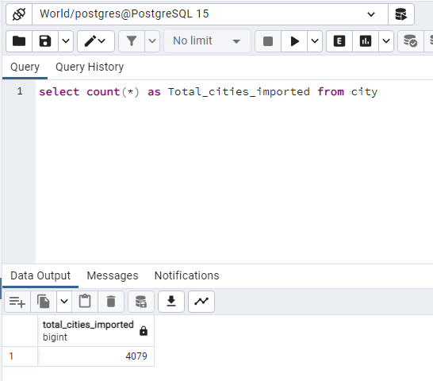
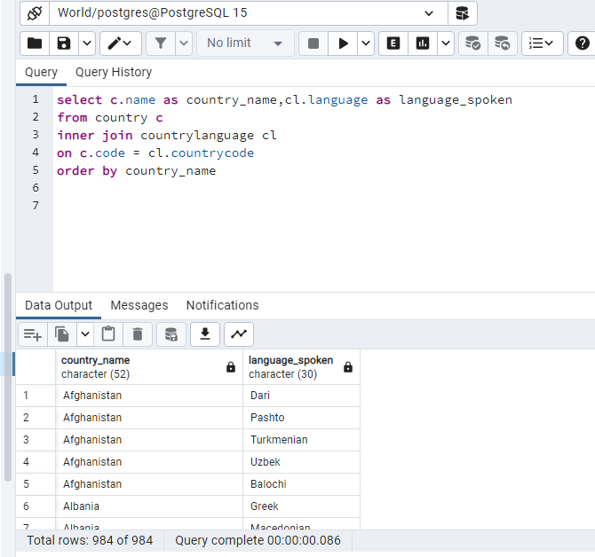
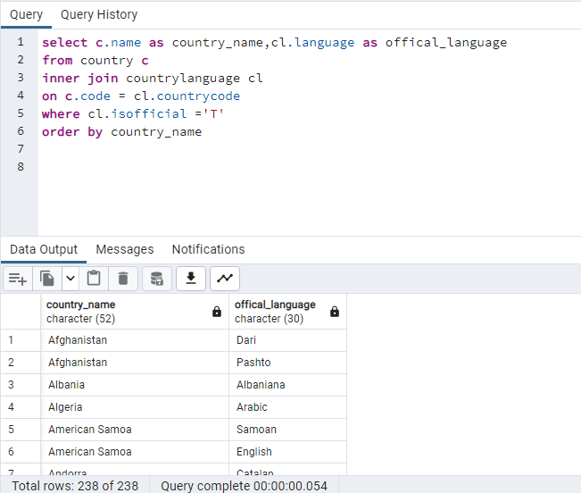
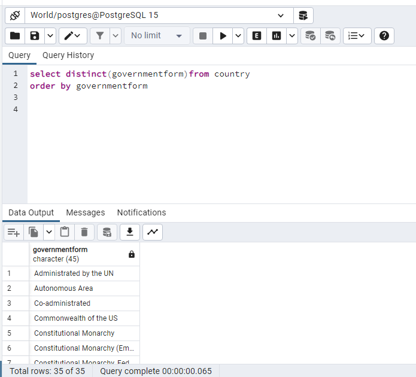
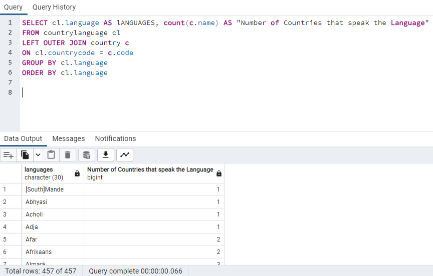
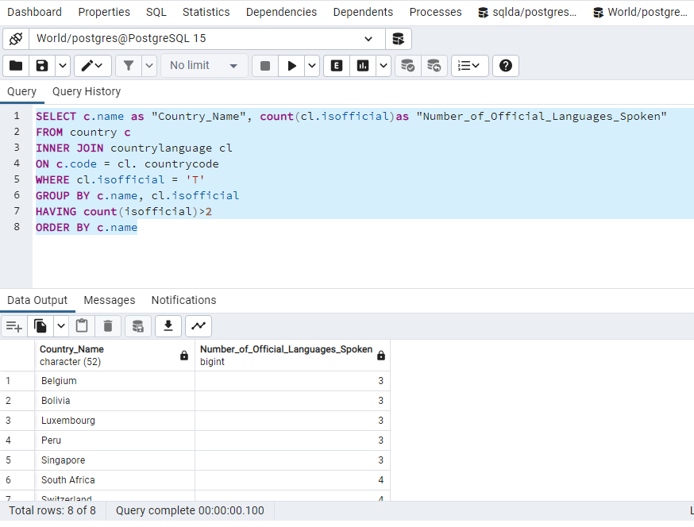
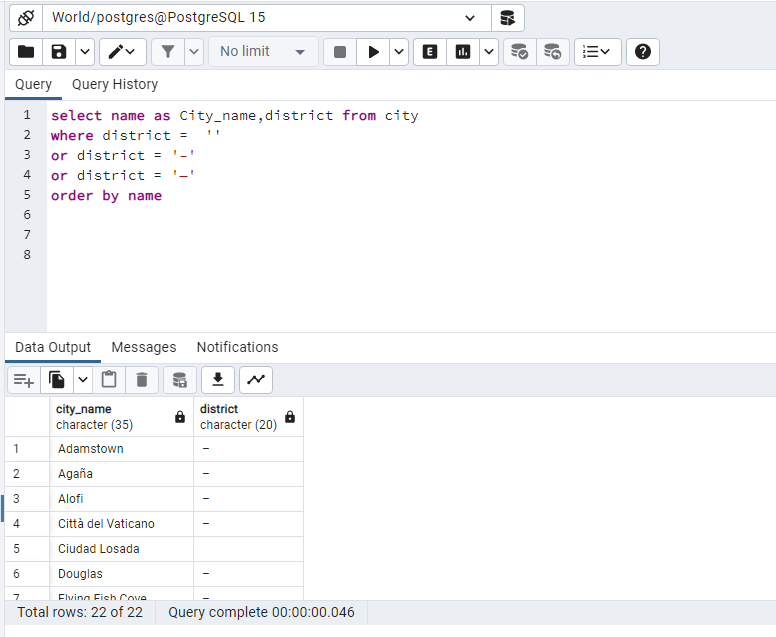
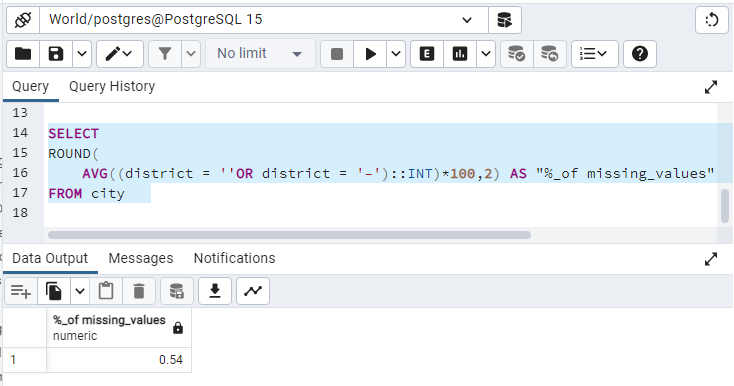

# Exercise 02: World Database – Joins, Grouping, and Data Quality

- Name:
- Course: Database for Analytics
- Module: 2
- Database Used: World Database (PostgreSQL)

---

## Instructions

- Answer each question below using SQL executed against the **World database**.
- All SQL commands **must be run by you**.
- For each SQL-based question:
  - Include the SQL command in a fenced code block
  - Include a **screenshot** showing the command and its results
- Store screenshots in the `screenshots/` folder and embed them below each answer.

---

## Question 1

When importing records from `worldPGSQL.sql`, **how many cities were imported**?

### Answer
_Write the number of cities imported._

### Screenshot
_Show evidence of how you determined this (for example, a COUNT query)._

```sql
SELECT COUNT(*) as Total_cities_imported FROM city
```



---

## Question 2

Using the World database, write the SQL command to **display each country name along with the name of each language spoken in that country**.

### SQL

```sql(method 1)
SELECT c.name,string_agg(cl.language,',') as languages_spoken
FROM country c
INNER JOIN countrylanguage cl
ON c.code = cl.countrycode
GROUP BY c.name
```
```sql(method 2)
SELECT c.name as country_name,cl.language as language_spoken
FROM country c
INNER JOIN countrylanguage cl
ON c.code = cl.countrycode
ORDER BY country_name
### Screenshot




---

## Question 3

Using the World database, write the SQL command to **display each country name along with the name of each official language spoken in that country**.

### SQL

```sql
SELECT c.name as country_name,cl.language as offical_language
FROM country c
INNER JOIN countrylanguage cl
ON c.code = cl.countrycode
WHERE cl.isofficial ='T'
order by country_name
```

### Screenshot



---

## Question 4

Consider the following two SQL statements:

```sql
SELECT *
FROM country, countrylanguage
WHERE country.code = countrylanguage.countrycode;
```

```sql
SELECT *
FROM country
LEFT OUTER JOIN countrylanguage
ON country.code = countrylanguage.countrycode;
```

**In your own words**, describe what data the **second query returns that the first query does not**.

### Answer
The second query returns all the countries from the left table including records that are not present in the right table.

---

## Question 5

Using the World database, write the SQL command to **list all different forms of government** found in the data.
Do **not** repeat any form of government more than once.

### SQL

```sql
SELECT DISTINCT(governmentform)FROM country
ORDER BY governmentform
```

### Screenshot



---

## Question 6

Using the World database, write the SQL command to **list all names of cities and countries in one column**.
Label the column **"City or Country Name"**.

### SQL

```sql
SELECT name AS "City or Country Name" FROM city
UNION
SELECT name AS "City or Country Name" FROM country
ORDER BY "City or Country Name"
```

### Screenshot


---

## Question 7

Using the World database, write the SQL command to **list all countries by name**, along with the **number of languages spoken in each country**.
Be sure to **sort by country name**.

### SQL

```sql
SELECT c.name as Country_Name,count(cl.language)as "number of languages spoken in each country"
FROM country c
LEFT JOIN countrylanguage cl
ON c.code = cl.countrycode
GROUP BY c.name
ORDER BY c.name
```

### Screenshot


---

## Question 8

Using the World database, write the SQL command to **list all languages**, along with the **number of countries where each language is spoken**.
Be sure to **sort by language name**.

### SQL

```sql
SELECT cl.language AS lANGUAGES, count(c.name) AS "Number of Countries that speak the Language"
FROM countrylanguage cl
LEFT OUTER JOIN country c
ON cl.countrycode = c.code
GROUP BY cl.language
ORDER BY cl.language
```

### Screenshot



---

## Question 9

Using the World database, write the SQL command to **list countries that have more than two official languages**, along with the **number of official languages spoken**.

*Hint: There are 8 such countries in this dataset.*

### SQL

```sql
SELECT c.name as "Country_Name", count(cl.isofficial)as "Number_of_Official_Languages_Spoken"
FROM country c
INNER JOIN countrylanguage cl
ON c.code = cl. countrycode
WHERE cl.isofficial = 'T'
GROUP BY c.name, cl.isofficial
HAVING count(isofficial)>2
ORDER BY c.name
```

### Screenshot



---

## Question 10

Using the World database, write the SQL command to **find cities where the district value is missing**.

*Hint: Use `LIKE` and the dash (`-`) since some rows use that instead of actual data.*

### SQL

```sql
select name as City_name,district from city
where district =  ''
or district = '–'
or district = '—'
order by name
```

### Screenshot



---

## Question 11

Using the World database, write the SQL command to **calculate the percentage of cities with missing district values**.

*Hint: The result should be approximately 0.4%.*

### SQL

```sql_1
SELECT
ROUND(
	AVG((district = ''OR district = '–')::INT)*100,2) AS "%_of missing_values"
FROM city
```
```sql_2
SELECT ROUND(
	         COUNT (*)* 100.0/ (SELECT count(*) FROM city),2 )AS "Percentage_of_cities_with_missing_values"
FROM (
    select name as City_name,district,
       CASE
	      WHEN district = ''
	       OR district = '–'
	     THEN 0
         ELSE 1
       END AS District_value
from city) AS t  
WHERE District_value = 0
```

### Screenshot


