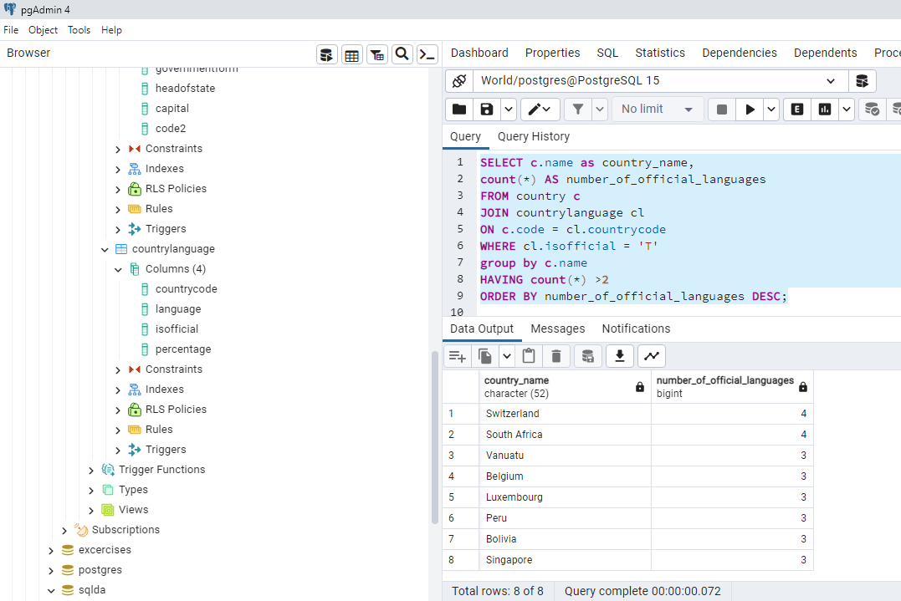
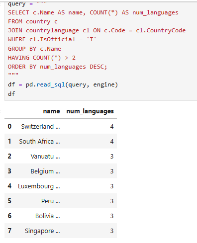
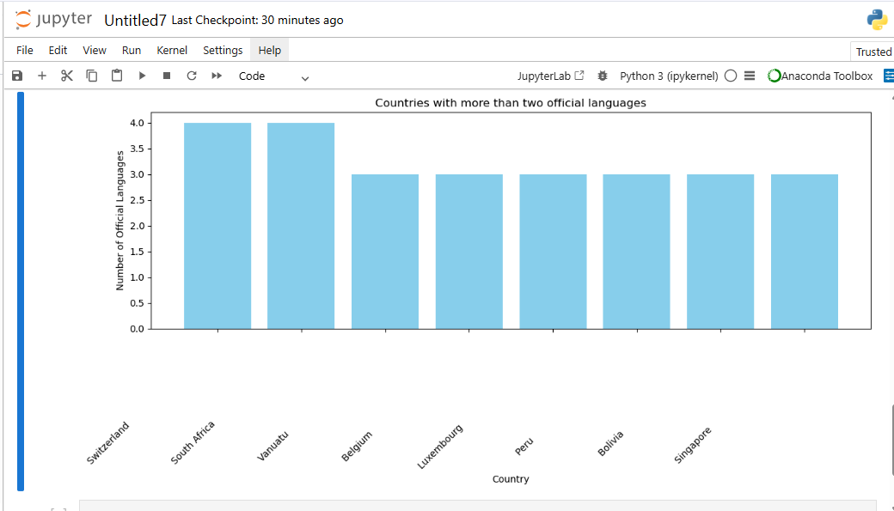

# Exercise 04: Advanced SQL, Jupyter, and Visualization

- Name: Rucmanidevi Sethu
- Course: Database for Analytics
- Module: 4
- Database Used: World Database
- Tools Used: PostgreSQL, SQLAlchemy, Pandas, Jupyter Notebooks

---

## Instructions

- Complete each task using the **World database** installed earlier.
- For SQL questions:
  - Write the SQL command in a fenced code block
  - Execute the command and include a **screenshot of the results**
- For Jupyter Notebook questions:
  - Include the required Python statements
  - Include **screenshots of the notebook output**
- Store all screenshots in the `screenshots/` folder and embed them below each question.

---

## Question 1

Considering the World database, write a SQL statement that will **display the names of countries that speak more than two official languages**, along with the **number of official languages spoken**.

- Sort the results by **number of languages**, from **most to least**.
- *Hint: There are fewer than 10 countries in the results.*

### SQL

```sql
SELECT c.name as country_name,
count(*) AS number_of_official_languages
FROM country c
JOIN countrylanguage cl
ON c.code = cl.countrycode
WHERE cl.isofficial = 'T'
group by c.name
HAVING count(*) >2
ORDER BY number_of_official_languages DESC;
```

### Screenshot

![Q1 Screenshot]

---

## Question 2

Using **Jupyter Notebooks**, you must use the `create_engine` command to connect to your database.

After the `create_engine` command is executed, **what are the three statements required to execute the query from Question 1 and display the results in the notebook**?

### Python Code

```python
query = """
SELECT c.Name AS name, COUNT(*) AS num_languages
FROM country c
JOIN countrylanguage cl ON c.Code = cl.CountryCode
WHERE cl.IsOfficial = 'T'
GROUP BY c.Name
HAVING COUNT(*) > 2
ORDER BY num_languages DESC;
"""
df = pd.read_sql(query, engine)
df

```

### Screenshot



---

## Question 3

Using **Jupyter Notebooks**, write the Python code needed to produce the following graph:


(The graph shows country-level results derived from the World database.)

### Python Code

```python
plt.figure(figsize=(12,6))
plt.bar(df['country_name'],df['number_of_official_languages'],color='skyblue')
plt.xlabel("Country")
plt.ylabel("Number of Official Languages")
plt.title("Countries with more than two official languages")
plt.xticks(rotation=45,ha='right')
plt.tight_layout()
plt.show()
```

### Screenshot


