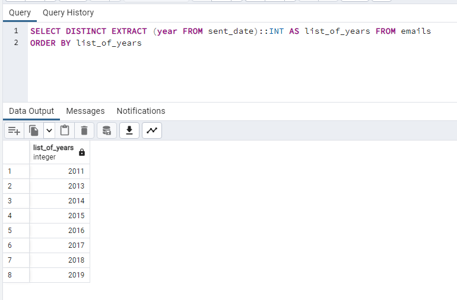
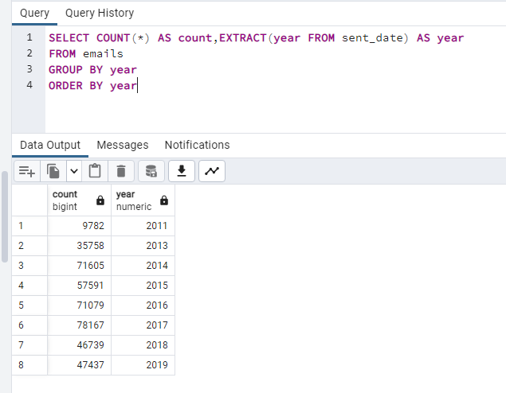
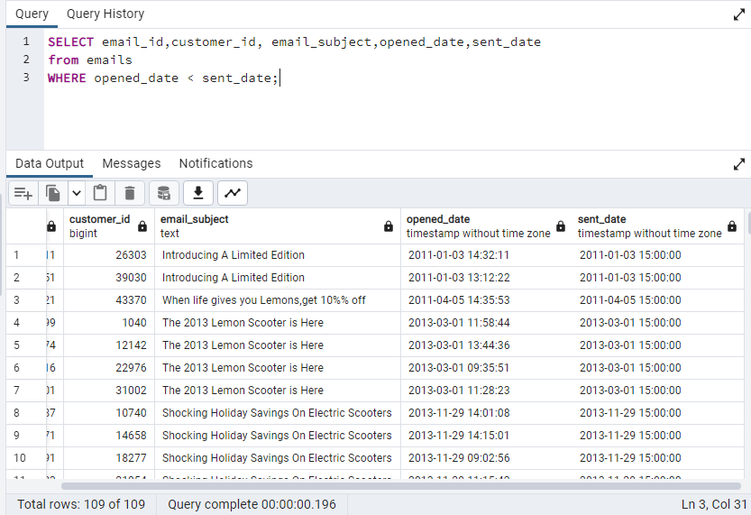
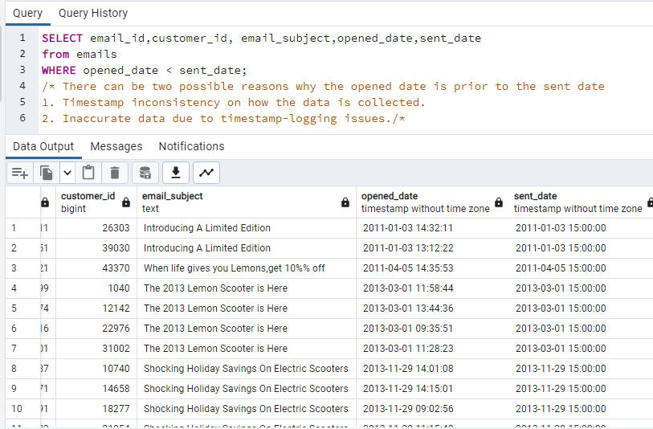
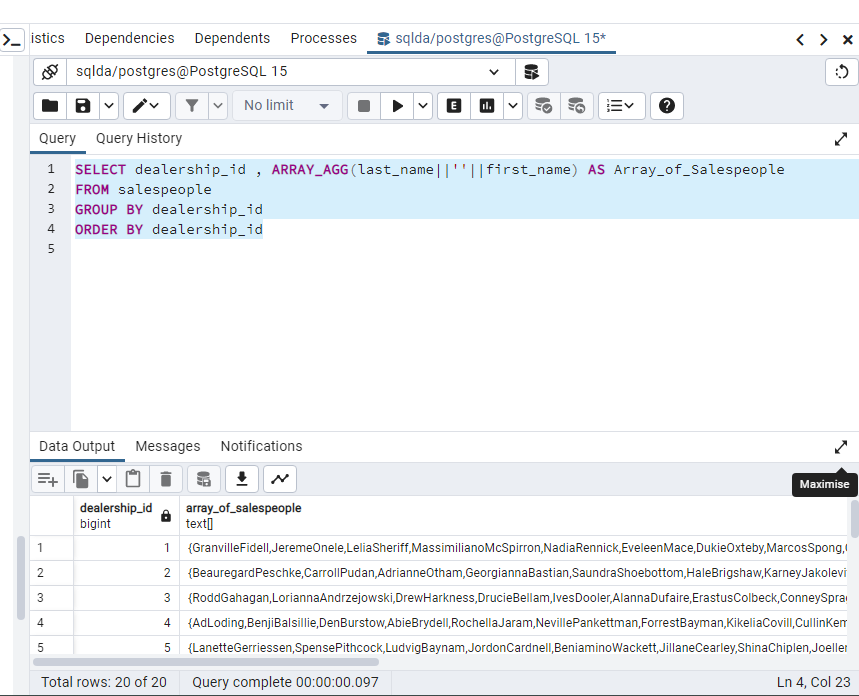
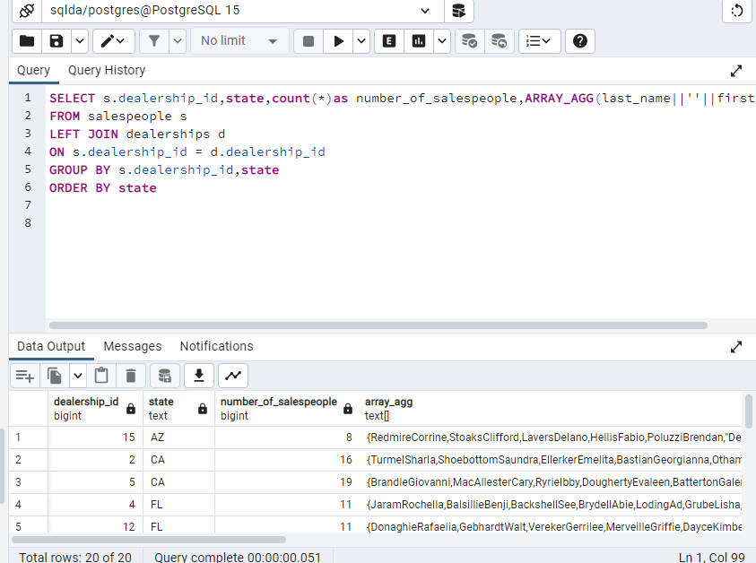
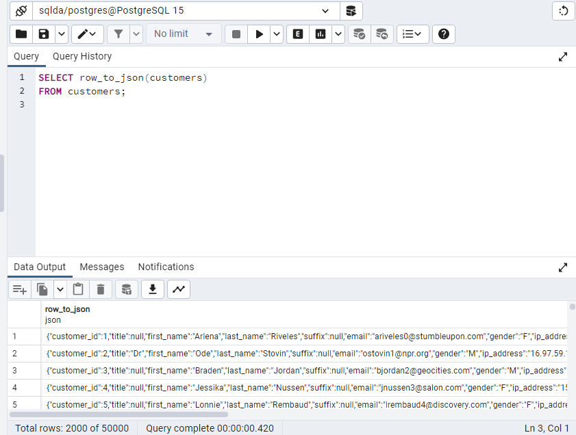
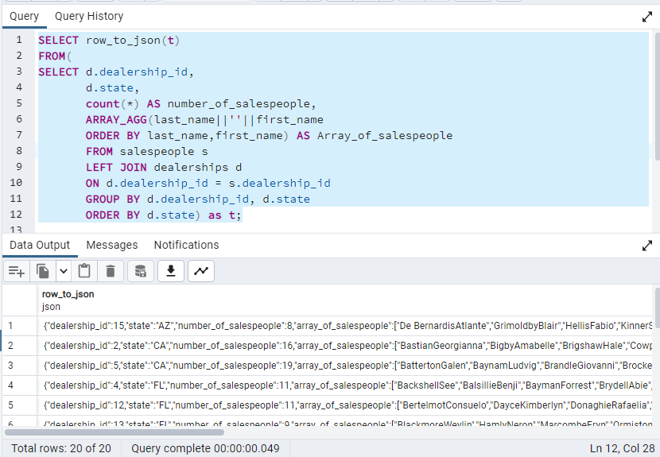

# Exercise 05: SQLDA Database - Dates, Data Quality, Arrays, and JSON

- Name:Rucmanidevi Sethu
- Course: Database for Analytics
- Module:5
- Database Used:  `sqlda` (Sample Datasets)
- Tools Used: PostgreSQL (pgAdmin or psql)

---

## Instructions

- Use the **sqlda** database from the "Loading the Sample Datasets" instructions.
- For each SQL task:
  - Include your SQL in a fenced code block
  - Execute it and include a **screenshot** showing the query and results
- Store screenshots in the `screenshots/` folder and embed them below each answer.
- For explanation questions:
  - Write your answer in complete sentences
  - Include a screenshot if requested

---

## Question 1

Using the `sqlda` database, write the SQL needed to show a **list of years** that emails were sent.

Your results should list years like this (order matters):

```
year
2011
2013
2014
2015
2016
2017
2018
2019
```

### SQL

```sql
SELECT DISTINCT EXTRACT (year FROM sent_date)::INT AS list_of_years FROM emails
ORDER BY list_of_years
```

### Screenshot



---

## Question 2

Using the `sqlda` database, write the SQL needed to show the **number of messages sent by year**, ordered by year (as shown in the prompt).

Output should resemble:

```
count   year
...
```

### SQL

```sql
SELECT COUNT(*) AS count,EXTRACT(year FROM sent_date) AS year
FROM emails
GROUP BY year
ORDER BY year
```

### Screenshot



---

## Question 3

Using the `sqlda` database, write the SQL needed to show:
- the **sent date**
- the **opened date**
- the **interval** between the two

Only include emails that contain **both** a sent date and an opened date.

### SQL

```sql
SELECT sent_date,opened_date,(opened_date-sent_date) AS Intreval
from emails
WHERE sent_date IS NOT NULL
AND opened_date IS NOT NULL
```

### Screenshot


---

## Question 4

Using the `sqlda` database, write the SQL needed to show emails that contain an **opened date BEFORE the sent date**.

### SQL

```sql
SELECT email_id,customer_id, email_subject,opened_date,sent_date
from emails
WHERE opened_date < sent_date;
```

### Screenshot



---

## Question 5

Using the `sqlda` database: there are **over 100 emails** that contain an opened date **BEFORE** the sent date.

After looking at the data, **why is this the case?**

### Answer

/* There can be two possible reasons why the opened date is prior to the sent date
1. Timestamp inconsistency on how the data is collected.
2. Inaccurate data due to timestamp-logging issues./*

### Screenshot (if requested by instructor)



---

## Question 6

Using the `sqlda` database, explain in your own words what the following code does:

```sql
CREATE TEMP TABLE customer_points AS (
    SELECT
        customer_id,
        point(longitude, latitude) AS lng_lat_point
    FROM customers
    WHERE longitude IS NOT NULL
    AND latitude IS NOT NULL
);

CREATE TEMP TABLE dealership_points AS (
    SELECT
        dealership_id,
        point(longitude, latitude) AS lng_lat_point
    FROM dealerships
);

CREATE TEMP TABLE customer_dealership_distance AS (
    SELECT
       customer_id,
       dealership_id,
       c.lng_lat_point <@> d.lng_lat_point AS distance
    FROM customer_points c
    CROSS JOIN dealership_points d
);
```

### Answer

The following code creates 3 Temporary tables customer_points, customer_dealership_distance and dealership_points. The customer_points table contains the customer_id and point representing location based on longtitude,latitude.The dealership_points table contains the dealership_id and the point representing the location of the dealership based on the longtitude, latitude.The customer_dealership_distance contains the customer_id , dealership_id and the distance based on every customer_id and cross joins with every dealship_id and calculates a straigt line distance between the points(c.lng_lat.pint-d.lng_lat)

---

## Question 7

Using the `sqlda` database, write SQL to display an **array of salespeople for each dealership**, sorted by dealership.

For example - dealership 1 is below:

```text
"{""Fidell,Granville"",""Onele,Jereme"",""Sheriff,Lelia"",""McSpirron,Massimiliano"",""Rennick,Nadia"",""Mace,Eveleen"",""Oxteby,Dukie"",""Spong,Marcos"",""Wogden,Quent"",""Duny,Sandye"",""Loraine,Englebert"",""Meere,Ira"",""Gibbens,Cristine"",""Prine,Lyda"",""McCoughan,Sheff"",""Schule,Giselbert"",""McAndie,Eleen"",""Dosedale,Dorie"",""Nafziger,Shay""}"
```

### SQL

```sql
SELECT dealership_id , ARRAY_AGG(last_name||''||first_name) AS Array_of_Salespeople
FROM salespeople
GROUP BY dealership_id
ORDER BY dealership_id
```

### Screenshot



---

## Question 8

Using the `sqlda` database, write SQL to display:
- an **array of salespeople for each dealership**
- the **state** of the dealership
- the **number of salespeople** for the dealership

Sort by **state**.

Reference image:


### SQL

```sql
SELECT s.dealership_id,state,count(*)as number_of_salespeople,ARRAY_AGG(last_name||''||first_name)
FROM salespeople s
LEFT JOIN dealerships d
ON s.dealership_id = d.dealership_id
GROUP BY s.dealership_id,state
ORDER BY state
```

### Screenshot



---

## Question 9

Using the `sqlda` database, write the SQL needed to convert the **customers** table to **JSON**.

### SQL

```sql
SELECT row_to_json(customers)
FROM customers;
```

### Screenshot



---

## Question 10

Using the `sqlda` database, write SQL to display:
- an **array of salespeople for each dealership**
- the **state**
- the **number of salespeople**
- sorted by **state**

Then **convert this result to JSON**.

Reference image:


### SQL

```sql
SELECT row_to_json(t)
FROM(
SELECT d.dealership_id,
	   d.state,
       count(*) AS number_of_salespeople,
	   ARRAY_AGG(last_name||''||first_name
	   ORDER BY last_name,first_name) AS Array_of_salespeople
	   FROM salespeople s
	   LEFT JOIN dealerships d  
	   ON d.dealership_id = s.dealership_id
	   GROUP BY d.dealership_id, d.state
	   ORDER BY d.state) as t;
```

### Screenshot


