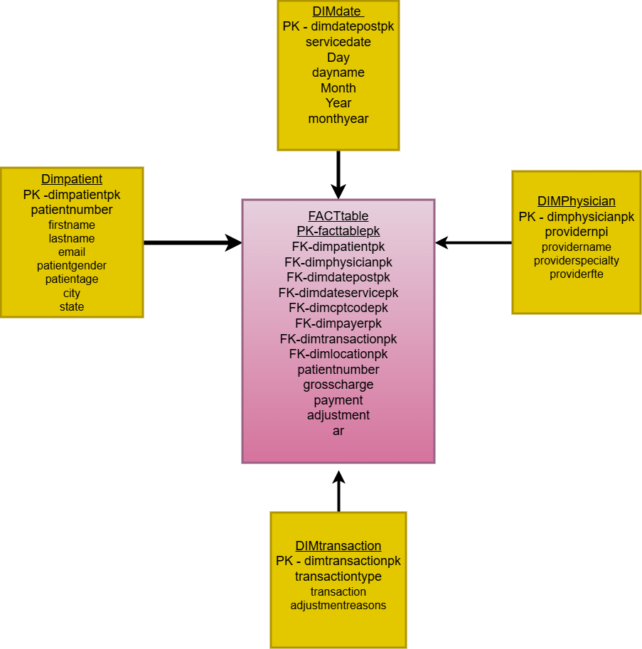
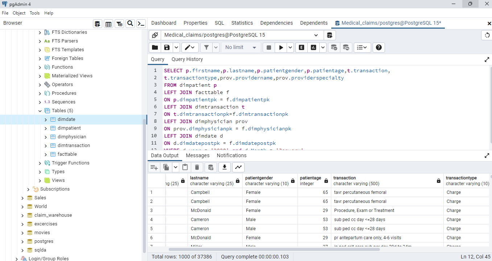
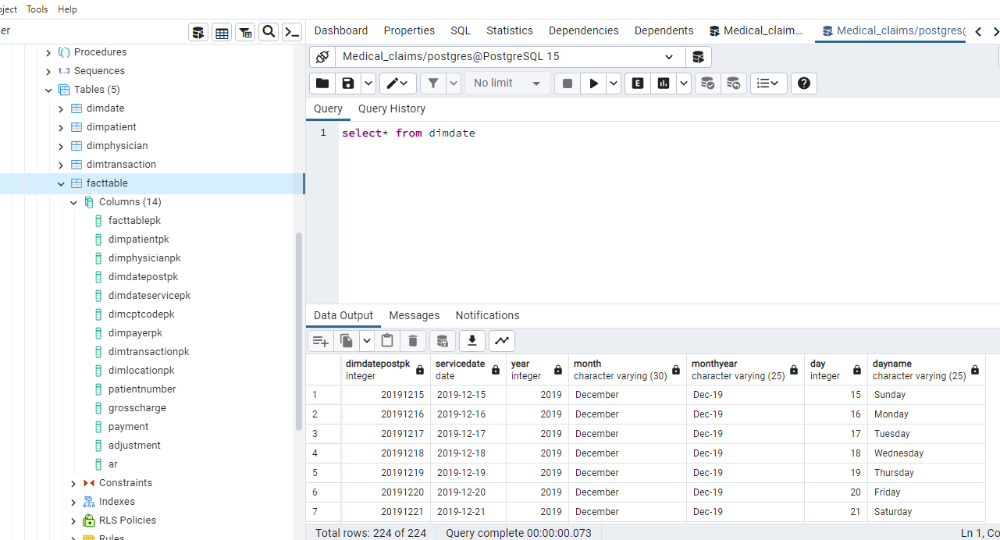
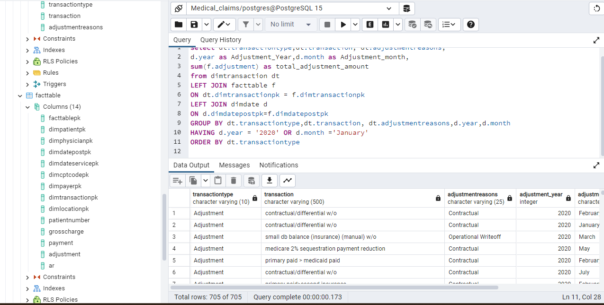

# Exercise 07: Medical Claims Database – Joins, Grouping, and Data Quality

- Name: Rucmanidevi Sethu
- Course: Database for Analytics
- Module: 7
- Database Used: Medical Claims Database (PostgreSQL)

---

## Instructions

The initial data source
The format of your data, include count of column and rows.
Show a data dictionary - a table describing each data attribute/feature/column.
Show your table structure including data types
Describe some of the obstacles you overcame to transform the data.
Select * from each of your tables
Show some interesting queries from your tables.  Include:
At least one join
At least one query where you group by and aggregate data
---
## The initial data source
[text](https://www.kaggle.com/datasets/tomaslui/healthcare-dataset/data)

##The format of your data, include count of column and rows.
The data is in the csv format.
The original dataset had 9 columns , but for the purpose of this excercise I created a star schema and copied 5 tables from the source dataset.
(Table 1-dimdate) it includes 7 columns and 224 rows.
(Table 2 -dimpatient) it includes  9 columns and 5117 rows.
(Table 3- dimphysician)it includes 5 columns and 932 rows
(Table 4- dimtransaction)it includes 4 columns and 955 rows
(Table 5-facttable)it includes 14 columns and 84219 rows.
## Show a data dictionary - a table describing each data attribute/feature/column.
"C:\Repos\databases-for-analytics\exercises\Data_dictionary.xlsx"
|Column	|Table|	Definition|
|-------|-----|------------|
FactTablePK	|FactTable(Primary Key)	|This column serves as a unique identifier for the table.|
dimPatientPK	|FactTable(Foreign Key) and dimPatient(Primary Key)	|Unique identifier that can be used to join the patient table to the fact table.|
dimPhysicianPK	|FactTable(Foreign Key) and dimPhysician(Primary Key)	|Unique identifier that can be used to join the physician table to the fact table.|
dimdatepostPK	|FactTable(Foreign Key) and dimdate(Primary Key)	|Unique identifier that can be used to join the dimdate table to the fact table.Text formatted date that specifies the date when the transaction was sent to billing.|
dimdateservicepk|	FactTable(Foreign Key) |	Text formatted date that specifies the date when service was provided .|
dimcptcodepk	|FactTable(Foreign Key)	|Unique identifier from an external CPT table.|
dimpayerpk	|FactTable(Foreign Key) |	Unique identifier that can be used to join the payer table and the fact table.|
dimtransactionpk|	FactTable(Foreign Key) and dimtransaction(Primary Key)|	Unique identifier that can be used to join the dimtransaction table to the fact table.|
patientnumber	|FactTable and dimPatient	Unique | this identifier that can be used to join the dimpatient table to the fact table.
grosscharge	|FactTable	|This includes the gross charge for the CPT code.|
payment|	FactTable	|This field indicates the payment received from the patient.|
adjustment|	FactTable	|This field includes the amount that can be adjusted .|
ar	|FactTable|	This field includes amount that is outstanding and to be collected.|
firstname|	dimPatient	|This field includes the patient's first name.|
lastname	|dimPatient	|This field includes the patient's last name.|
email|	dimPatient|	This field includes the patient's email address.|
patientgender|	dimPatient	|This field includes the patient's  gender.|
patientage	|dimPatient	|This field includes the patient's  age.|
city	|dimPatient	|This field includes the patient's  city of residence.|
state|	dimPatient	|This field includes the patient's  state of residence.|
providernpi	|dimPhysician|	Unique number assigned to physician for billing.|
providername|	dimPhysician	|Name of the Physician.|
providerspecialty	|dimPhysician	|The Specialty the Physician specialises.|
providerfte	|dimPhysician	|Time spent by the physician on a weekly basis.|
transactiontype|	dimTransaction	|Specifies the category of transaction(Adjustment, payment or charge).|
transaction|	dimTransaction|	Description of the transaction.|
adjustmentreasons	|dimTransaction|	Specifies the reason for adjustment in payment.|
servicedate|	dimDate	|The date when service was rendered in the Date format.|
year|	dimDate	|The Year of service.|
month	|dimDate|	The month name of service
monthyear	dimDate	The month and year when service was provided.|
day	|dimDate|	The day of service.|
dayname	|dimDate	|The day name of service.|
## Describe some of the obstacles you overcame to transform the data.
The major obstacle was the character length limits in columns.
Somefields in the raw data were longer than the columns defined initially while creating the table, so I had to Alter table and increase the character length to fit the data within those fields.
## Show your table structure including data types

##Show some interesting queries from your tables.  Include:
At least one join
At least one query where you group by and aggregate data



##-------------------------------------------------------------##
```SQL Query
select dt.transactiontype,dt.transaction, dt.adjustmentreasons,
d.year as Adjustment_Year,d.month as Adjustment_month,
sum(f.adjustment) as total_adjustment_amount
from dimtransaction dt
LEFT JOIN facttable f
ON dt.dimtransactionpk = f.dimtransactionpk
LEFT JOIN dimdate d
ON d.dimdatepostpk=f.dimdatepostpk
GROUP BY dt.transactiontype,dt.transaction, dt.adjustmentreasons,d.year,d.month
HAVING d.year = '2020' OR d.month ='January'
ORDER BY dt.transactiontype
````
